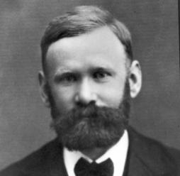

Erlang tutorial day 1
=====================


Table of Contents
-----------------

1. [Introduction](#1-introduction)
2. [Setup](#2-setup)
3. [Erlang shell, variables, types, modules, functions](#3-erlang-shell-variables-types-modules-functions)
4. [Exercises](#4-exercises)
5. [Recommendation](#5-recommendation)

1 Introduction
--------------

**This tutorial**

[](http://learnyousomeerlang.com/content) [](https://github.com/oreillymedia/etudes-for-erlang)

**Erlang**

- History: Makes it easier to build scalable, fault-tolerant systems
- Functional programming language with dynamic typing
- Processes, node → concurrency, multi-core, distribution
- Tracing and hot code loading

[](https://en.wikipedia.org/wiki/Agner_Krarup_Erlang)

2 Setup
-------


### 2.1 [Setup](http://learnyousomeerlang.com/introduction)

Installation

- Windows: http://www.erlang.org/downloads
- [Linux/Mac packages from Erlang Solutions](https://www.erlang-solutions.com/resources/download.html)
- Linux (usually not the newest): `apt-get install erlang`, `yum install erlang`
- Mac: `brew install erlang`, `port install erlang`
- [kerl](https://github.com/kerl/kerl)
    - for Linux and Mac
    - installs Erlang from source
    - handles multiple Erlang versions
    - bashrc config:
      ```bash
      export KERL_DEFAULT_INSTALL_DIR=$HOME/.kerl/installations/
      export KERL_ENABLE_PROMPT=true
      ```

Editor/IDE: Emacs, Vim, IntelliJ IDEA, Visual Studio Code, Sublime, ...

3 Erlang shell, variables, types, modules, functions
----------------------------------------------------


### 3.1 [Starting Out - The Shell](http://learnyousomeerlang.com/starting-out)

**The Shell**: `werl.exe` (Windows), `erl` (anything else)

**Shell Commands**:

- Up/down (history), ctrl-a (home), ctrl-e (end)
- Terminate expressions with a period (.)
- Quit:  `q()`  or  `ctrl-c a`

### 3.2 [Starting out (for real)](http://learnyousomeerlang.com/starting-out-for-real)

**Numbers**: `+`, `-`, `*`, `/`, `div`, `rem`

**Invariable Variables**

- `One = 1`
- Variables start with a capital letter
- `=`: assignment (it actually does pattern matching)
- We don't change variables; we bind them
- `f()`, `f(Var)`: forget variables in the shell

**Atoms**: `atom`, `'Special atom'`

**Boolean Algebra & Comparison operators**

- `true`, `false`
- `=:=`, `=/=`

**Tuples**

- `Point = {4, 5}.`
- `element(1, Point).`

### 3.3 [Modules](http://learnyousomeerlang.com/modules)

**What are modules**: `lists:seq(1, 4).`

**Module declaration**: [see useless.erl](useless.erl)

**Compiling the code**

```erlang
> c(useless).
> useless:greet_and_add_two(-3).
> useless:module_info().
```

### 3.4 [Type Specifications and Erlang](http://learnyousomeerlang.com/dialyzer)

**Typing Functions**

- [See useless.erl](useless.erl)
- `edoc:run(["useless.erl"], []).  % Produces useless.html.`

4 Exercises
-----------


### Exercise 1: Installation

Install Erlang.

### Exercise 2: Shell

[Étude 1: Getting Comfortable with Erlang](https://github.com/oreillymedia/etudes-for-erlang/blob/master/ch01-getting-comfortable.asciidoc).

### Exercise 3: Geometry

[Étude 2: Functions and Modules](https://github.com/oreillymedia/etudes-for-erlang/blob/master/ch02-functions_and_modules.asciidoc).

Example solutions:
[Étude 2-1](https://github.com/oreillymedia/etudes-for-erlang/tree/master/code/ch02-01),
[Étude 2-2](https://github.com/oreillymedia/etudes-for-erlang/tree/master/code/ch02-02),
[Étude 2-3](https://github.com/oreillymedia/etudes-for-erlang/tree/master/code/ch02-03).

### Exercise 4: One Year Long Mission

Use the shell to calculate how many months did the ["ISS One Year Long
Mission"][one_year_long_mission] take, considering that it took 342 days. (If you)
are stuck: first calculate the length of the average month.)

[one_year_long_mission]: https://en.wikipedia.org/wiki/ISS_year_long_mission

[Example solution](one_year.md).

### Exercise 5: Temperature

Extra 2: Write functions `temp:f2c(F)` and `temp:c2f(C)` which convert between
centigrade and Fahrenheit scales.
([Source](http://erlang.org/course/exercises.html).)

If you want to convert Celsius to Fahrenheit, just multiply the temperature by
1.8 and then add 32 to the product. If you want to convert temperature from
Fahrenheit to Celsius, subtract 32 from the number and then divide the
difference by 1.8.

Don't forget to add type specs and docstrings.

[Example solution](temp.erl).

### Exercise 6: Time

1. Write the function `time:hms_to_seconds(H, M, S)` that converts a time
   duration given as hours:minutes:seconds into seconds. E.g.

2. Implement the following inverse functions:

   ```erlang
   time:seconds_to_h(Seconds)
   time:seconds_to_m(Seconds)
   time:seconds_to_s(Seconds)
   ```
     
   The following must hold for all non-negative integers:

   ```erlang
   time:hms_to_seconds(time:seconds_to_h(Seconds),
                       time:seconds_to_m(Seconds),
                       time:seconds_to_s(Seconds)) =:= Seconds
   ```

3. Implement the inverse function `time:seconds_to_hms(Seconds)`, which returns
   a `{H, M, S}` tuple. The following must hold for all non-negative integers:

    ```erlang
    H = element(1, time:seconds_to_hms(Seconds)),
    M = element(2, time:seconds_to_hms(Seconds)),
    S = element(3, time:seconds_to_hms(Seconds)),
    time:hms_to_seconds(H, M, S) =:= Seconds
    ```
Don't forget to add type specs and docstrings.

[Example solution](time.erl).

5 Recommendation
----------------

Watch "Erlang: The Movie". It's only 11 minutes:

[](https://www.youtube.com/watch?v=xrIjfIjssLE)
